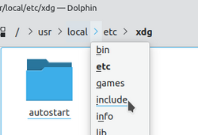

# Breadcrumb Navigation

A breadcrumb trail is a horizontal navigation element that shows a user's current position within a site's hierarchy, typically as a sequence of clickable links leading from the homepage to the current page. The name comes from the Hansel and Gretel fairy tale, where characters left a trail of bread crumbs to mark their path back.

Breadcrumbs answer the question "where am I?" without requiring users to navigate away from the page, and provide a one-click shortcut to any ancestor level in the hierarchy. They are a secondary navigation aid — not a replacement for primary navigation — and are most useful on sites with three or more levels of depth.

## Three types

**Location breadcrumbs** (also called hierarchical) are the most common on the web. They reflect the site's information architecture rather than the user's browsing path — showing where the current page sits in the hierarchy regardless of how the user arrived. Example: `Home > Clothing > Women > Jackets`. This is the appropriate default for most sites.

**Attribute breadcrumbs** reflect the current page's category memberships rather than its position in a tree. Example: `Leather / Women's / Sale`. Common in e-commerce and content libraries where items belong to multiple facets simultaneously. Often rendered as chips or tags rather than a linear chain.

**Path breadcrumbs** record the sequence of pages the user actually visited — equivalent to the browser's back-history rendered as a visible trail. Rare in practice; they grow arbitrarily long, depend on arrival path rather than site structure, and create inconsistent trails for the same page. Avoid.

## Placement and visual convention

Standard placement: a single horizontal row, positioned below the site header/masthead and above the main content, so it's readable without scrolling and clearly separated from both the navigation and the content body.

Standard visual separator: `>` or `›` between levels. `/` is used by some platforms (GitHub, Google Docs). Graphical arrows and chevrons are common alternatives. The separator should be visually lighter than the link labels so it reads as punctuation, not content.

The current page is typically the last item in the trail and rendered as plain text (not a link), since linking to the current page serves no purpose and creates a redundant click target.

## When to use

Breadcrumbs add clearest value when:
- The site has three or more levels of hierarchy
- Users are likely to arrive mid-hierarchy (from search engines or direct links) rather than always entering from the homepage
- The hierarchy is stable and content belongs to one clear category path

Breadcrumbs work poorly when content belongs to multiple categories simultaneously — showing one arbitrary path through the taxonomy misrepresents the page's position. In those cases, attribute tags (faceted navigation) are a better fit, and breadcrumbs can be omitted or supplemented.

## Relationship to other navigation patterns

Breadcrumbs are one part of a site's orientation system. [[multiple-ways-to-navigate]] frames this system as serving users' need to recover from wrong turns alongside their forward-navigation needs. [[interface-design-principles]] (principle 5: user control and freedom) describes breadcrumbs explicitly as an "exit" mechanism: they let users undo a navigation mistake without pressing the browser back button repeatedly.

On the SEO side, breadcrumb markup (via JSON-LD structured data or `aria-label` breadcrumb navigation) is recognized by Google and can appear as a path trail below the page title in search results, replacing the raw URL — a small but meaningful click-through improvement. See [[seo-basics]].

## Current page and trail structure

The current page should be the last item in the trail — rendered as plain text (not a link) since linking to the page you are already on is a redundant and confusing click target. The trail starts at the homepage and ends at the parent section; the current page itself is omitted from the link chain. This structure ensures every breadcrumb link moves the user to a different page.

On mobile viewports where horizontal space is limited, a common pattern is to collapse the middle of the trail and show only the first item (home) and the last linked item (parent), removing intermediate levels. This gives the user the two most useful escape routes — all the way back to the top, or one level up — without wrapping a long trail across multiple lines.

## When not to use breadcrumbs

Breadcrumbs are most often misapplied in two contexts:

- **Flat-structure sites**: when all pages are at the same level with no hierarchy below the homepage, a breadcrumb adds no information. Users already know they're one level deep.
- **Linear transactional flows** (checkout, application forms, registration): breadcrumbs imply free movement through a hierarchy. In a linear flow where the user must complete steps in order, breadcrumbs give a false impression of navigability and can disrupt the intended sequence. Use a [[progressive-disclosure|step indicator]] instead, which shows progress without implying free navigation.

## Accessibility

The ARIA authoring practices specify wrapping a breadcrumb in a `<nav>` element with `aria-label="Breadcrumb"` and marking the last item (current page) with `aria-current="page"`. This lets screen reader users identify the element as navigation and understand which level they are currently on.
