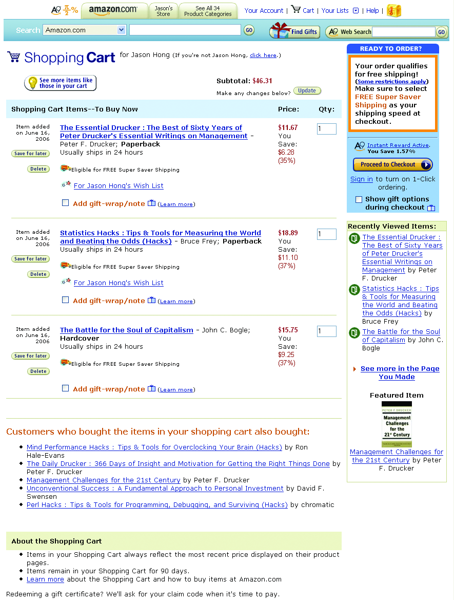

# Cross-Selling and Up-Selling

**Problem:** customers shopping for one item often have related needs they haven't thought to look for, but pushing related products too aggressively crowds the page and annoys them — the same line a pushy in-store salesperson can cross.

**Solution:** in sales terms, cross-selling promotes accessories or complementary items ("do you want fries with that?"), while up-selling promotes a better, pricier version of the same choice ("do you want to supersize that?") — in practice the distinction blurs, and both serve the same goal: help customers find useful related items faster while increasing revenue per sale.

- **Connect products automatically from purchase data.** Group products customers buy together and rank by co-purchase frequency to surface the top three to five related items on a [[clean-product-details|product page]] — this updates itself as behavior changes, unlike hand-merchandised relationships (more work, but lets staff explain *why* two products go together).
- **Keep related products visually secondary.** Set them off in their own labeled module, separate from the main product, so the page doesn't read as cluttered — the main product should always get more screen space than what's recommended alongside it.
- **Let customers add a related item without losing their place** — a quick-purchase [[action-buttons|action button]] (or checkbox) that adds the item to the cart without navigating away keeps the original purchase from getting derailed.
- **Repeat the offer at checkout, not just on the product page** — surfacing related items again in the [[shopping-cart|cart]], the [[quick-flow-checkout|order summary]], or even the confirmation page recovers customers who missed the recommendation the first time; Amazon does this with both forward links from the cart and a second pass after checkout completes.

**Forces:** the more screen space and the more aggressively related products are promoted, the more they compete with — and can actively undermine — the primary sale they're meant to support.
