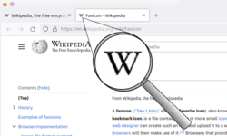

# Favicon

A favicon is a small icon associated with a website, displayed by browsers in tabs, bookmarks, address-bar dropdowns, and browser history lists. On mobile devices, it appears as the home-screen icon when a user saves a site to their home screen.

The name is a portmanteau of "favorites icon" — introduced by Internet Explorer 5 in 1999, originally only appearing for bookmarked sites. All modern browsers now display favicons on every page visit, whether or not the site is bookmarked.

## Why it matters

**Brand recognition** — at small sizes, a favicon is often the only visual brand element visible while a tab is in the background. A distinctive, legible icon reinforces site identity and helps users navigate between open tabs quickly.

**Credibility signal** — a missing or broken favicon is a minor but noticeable sign of an unpolished or incomplete site. Along with a custom domain and HTTPS, having a properly configured favicon is part of the baseline legitimacy floor that [[trust-and-credibility]] describes.

**Performance** — all modern browsers automatically request `favicon.ico` from the site root on every page load, regardless of whether the site declares one. A missing favicon results in a 404 error on every visit — unnecessary server log noise and a small but real wasted request. Serving a valid favicon eliminates this.

**SEO** — favicons appear in Google search results (in the address line above the page title on mobile) and in browser history, reinforcing brand recognition at points where users choose whether to revisit a site. See [[seo-basics]].

## Formats and sizes

The original format was ICO (`.ico`), required by Internet Explorer 5–10. Modern browsers support PNG, JPEG, GIF, APNG, and SVG, with ICO support universal across all browsers. **PNG is the practical modern default**; SVG is supported by all major browsers except Internet Explorer and is the best choice for new sites because it scales cleanly to any size from a single file.

Standard sizes:

| Context | Size |
|---|---|
| Browser tab | 16×16 px |
| Bookmark / taskbar | 32×32 px |
| Desktop shortcut | 48×48 px |
| iPhone home screen | 180×180 px |
| iPad home screen | 167×167 px |
| Android home screen | 192×192 px |

ICO files can bundle multiple sizes in one file, so older sites often used a single `.ico` containing 16×16, 32×32, and 48×48 variants.

## Mobile home screen icons

When users save a site to their device home screen, the favicon becomes a full app icon:

- **iOS**: provide `<link rel="apple-touch-icon">` in the `<head>`. Without it, iOS uses a screenshot of the page as the icon. iOS rounds the corners automatically; sizes: 180×180 (iPhone), 167×167 (iPad).
- **Android**: provide a `<link rel="icon">` with a `sizes` attribute, or a Web Manifest JSON file declaring icon paths and sizes. Recommended: 192×192 minimum, 512×512 for high-resolution splash screens.

## Design considerations

**Legibility at 16×16** is the primary constraint. A favicon that works at 32×32 may become an unrecognizable smear at 16×16. Common approaches: use a letterform from the brand wordmark, a simplified version of the logo mark, or a distinct symbol — never a scaled-down version of the full logo. Test by actually resizing the candidate image to 16×16 and viewing it at 100%.

**SVG favicons** allow a single file to serve all sizes and support dark-mode variants via CSS `prefers-color-scheme` media queries — the favicon can invert or change color to remain visible against both light and dark browser chrome.

**Avoid mimicking browser UI elements** — a padlock icon, for example, sits near the browser's security indicator in the tab bar and can mislead users about connection security. This is both a UX failure and an active phishing vector.

## Root directory fallback

Placing a `favicon.ico` file at `https://example.com/favicon.ico` allows browsers to find it automatically without any HTML declaration. This serves as a reliable fallback but should not replace explicit `<link rel="icon">` tags, which allow format control (SVG, PNG), multiple size declarations, and mobile-specific icons.
