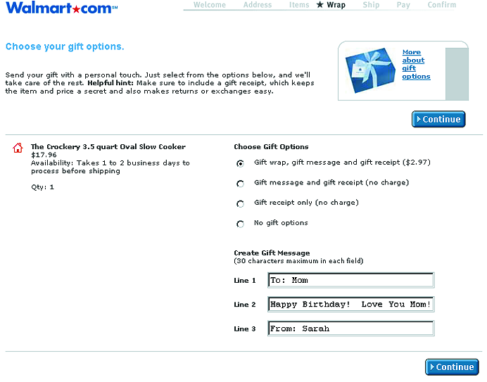

# Gift Giving

**Problem:** customers buying something as a gift have needs an ordinary checkout doesn't address — hiding the price from the recipient, attaching a personal note, paying for wrapping — and a site that ignores these loses gift-buying customers to one that handles them.

**Solution:** extend the standard checkout's [[process-funnel|process funnel]] with gift-specific steps rather than treating gifting as a separate flow:

- **Never show prices to the recipient.** The packing slip that ships with a gift order should omit prices and item names where the customer requests it, while still including enough information (sender, recipient, order number, return instructions) for the recipient to make an exchange.
- **Let customers attach a note per item, not just per order** — different gifts in the same order may go to different people even at the same address, so notes need to be assignable per item, with a [[action-buttons|Save Gift Options action button]] returning to the order summary.
- **Disclose gift-wrap pricing up front**, next to the option itself, rather than surprising customers with it later — larger items typically cost more to wrap, so per-item pricing has to reflect that rather than charging a flat rate.
- **Show gift options in the order summary and confirmation**, the same way [[multiple-destinations]] groups shipping by address, so customers can verify wrap/note/price details before and after placing the order.
- **Offer a recommendation system for choosing what to give** — a gift-specific extension of [[personalized-recommendations]], walking customers through identifying a recipient's interests and surfacing editorialized, currently-in-stock suggestions (Amazon's "find a gift" flow is the worked example).

**Forces:** gift options add steps to an already-sensitive checkout funnel, so each one needs to earn its place — Gift Giving and [[multiple-destinations]] are easy to combine in the same order (a customer sending several gifts to several people), but each adds its own review burden to the final order summary.
