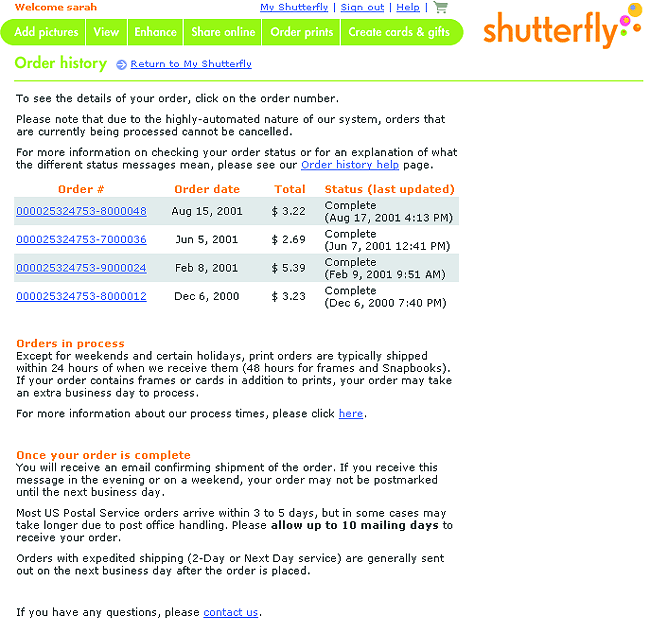

# Order Tracking and History

**Problem:** customers who've placed an order often need to check its status or change something about it, and routing every such question through a phone-staffed call center is expensive for the business and slow for the customer.

**Solution:**

- **Require sign-in, then show order history grouped by status** (pending, shipped, completed) rather than one undifferentiated list, listed in chronological order with item contents shown when the list is short enough to scan.
- **Set expectations proactively on pending orders.** If a product is delayed, out of stock, or discontinued, notify the customer rather than letting them discover it only when the order doesn't arrive — customers tolerate bad news delivered early far better than a broken promise discovered late.
- **Allow self-service order modification** wherever the back-end fulfillment system supports it — shipping address, shipping method, billing, items, and quantities can each be routed to the page that already handles that data (address selection, [[multiple-destinations]], payment method, product detail, the cart), with an [[action-buttons|action button]] on the order-history entry to jump straight to the relevant edit. Some changes stop being possible once fulfillment begins; tell the customer this rather than letting a failed edit be their first sign of it.
- **Surface real tracking data once an order ships** — linking directly to the shipper's own tracking database (date/time at each way station) rather than a vague "shipped" status, which requires storing the shipper's tracking number and integrating with their system.

**Forces:** self-service modification only pays off once it's integrated with real fulfillment back-end data — a tracking or "edit order" feature that shows stale or wrong status does more damage to trust than not offering self-service at all, since it actively misleads rather than just being unhelpful.

The sibling post-purchase pattern is [[easy-returns]]: while order tracking addresses what the customer needs before delivery (status updates, order modification), easy returns addresses what happens after delivery when a product needs to go back.
