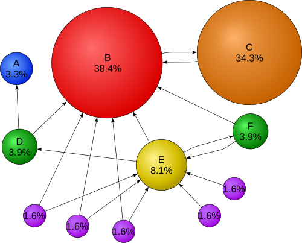
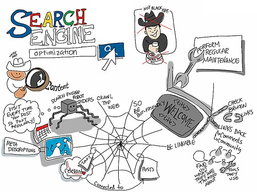

# Search Engine Optimization

Search engine optimization (SEO) is the practice of improving a site's visibility in organic (unpaid) search engine results pages (SERPs). Organic results are ranked by relevance rather than purchased, which makes the ranking algorithm — and designing to work with it — the central concern.

SEO is part of the broader category of search engine marketing (SEM); the key distinction is that SEM also encompasses paid search advertising (pay-per-click), while SEO focuses on earning placement rather than buying it.

## How search engines work

**Crawling** — automated programs called web crawlers (or "spiders") systematically follow links from page to page, discovering content to add to the search engine's index. A page not linked from anywhere that is already indexed may never be found by a crawler.

**Indexing** — the crawler's findings are added to a database, where each page's content, metadata, and link relationships are stored and made searchable.

**Ranking** — when a user submits a query, the engine scores indexed pages against hundreds of factors — keyword relevance, inbound link authority, content quality, page speed, mobile usability, freshness, and engagement signals — and returns the most relevant results.

The PageRank algorithm (developed at Stanford in 1998) was the foundational breakthrough in link-based ranking: it estimates a page's importance by the quantity and authority of pages linking to it, modeled as the probability that a random web user following links would eventually land on that page.

*PageRank distributes authority through links. A page with many inbound links from authoritative pages ranks higher than one with many links from low-authority pages.*

## Getting your pages indexed

- **XML sitemap** — a file listing every URL on the site that should be indexed, submitted through Google Search Console (or Bing Webmaster Tools). Sitemaps ensure deep pages are reachable even if they're not well-linked internally.
- **robots.txt** — a plain-text file in the site's root directory that instructs crawlers which paths to avoid. Commonly used to exclude login pages, internal search results, shopping carts, and user-specific content that would be meaningless in a search result and constitute "search spam." As of 2020, Google treats robots.txt as a hint rather than a directive.
- **`noindex` meta tag** — `<meta name="robots" content="noindex">` on an individual page tells crawlers not to include that page in the index, even if they visit it. Useful when robots.txt exclusion is too coarse-grained.
- **Internal linking** — pages deep in the site hierarchy that aren't linked from well-crawled pages may never be discovered. Shallow navigation hierarchies (fewer clicks from the homepage to any page) improve crawl coverage, and internal links to important pages increase how often crawlers visit them.

## On-page factors

**Title tag** — the `<title>` element in the HTML `<head>` is the most important on-page ranking signal and the clickable headline shown in search results. It should be descriptive, include the page's primary keyword, and be unique across all pages on the site.

**Meta description** — the `<meta name="description">` tag is not a direct ranking factor but strongly influences click-through rate: search engines often display it as the snippet below the title in results. A clear, specific description that matches the page's content is more likely to earn a click.

**URL structure** — descriptive, human-readable URLs improve both ranking and click-through. Prefer `/about/team` over `/page?id=47`. Use hyphens, not underscores, to separate words (search engines treat hyphens as word separators). Keep URLs as short as is still descriptive.

**Heading hierarchy** — a clear H1 naming the page's topic, followed by logically nested H2/H3 subheadings, helps crawlers understand page structure and improves accessibility simultaneously.

**Content quality and freshness** — search engines reward accurate, in-depth content that earns inbound links naturally. Thin or duplicated content is penalized. Updating content regularly signals freshness and invites more frequent crawling.

**URL canonicalization** — when the same page is accessible at multiple URLs (e.g. with and without a trailing slash, with HTTP and HTTPS, or via a CDN URL), a canonical link element (`<link rel="canonical" href="...">`) or 301 redirect consolidates link authority to a single preferred version rather than splitting it across duplicates.

## Mobile-first indexing

Since November 2016, Google uses a site's **mobile version** as the primary source for indexing and ranking — not the desktop version. A site that renders well on desktop but poorly on mobile is penalized across all devices, not just mobile searches. This makes [[responsive-web-design]] and [[mobile-first-design]] a prerequisite for competitive search visibility, not an optional enhancement.

## White hat, black hat, grey hat

**White hat** — techniques that conform to search engine guidelines: creating genuinely useful content, earning inbound links naturally, using accurate metadata, and maintaining good site structure. Produces durable results because it aligns with what ranking algorithms are designed to reward.

**Black hat** — techniques that game ranking signals in ways search engines prohibit: hidden text (same color as background), cloaking (showing different content to crawlers than to humans), paid link schemes, doorway pages. Risks penalties ranging from ranking reduction to complete removal from the index. BMW Germany and Ricoh Germany were both de-indexed in 2006 for doorway-page cloaking; both were restored after removing the offending content.

**Grey hat** — approaches that aren't explicitly prohibited but don't optimize for genuine user value. Avoids the worst penalties but doesn't produce the durable ranking gains of genuine white-hat work.

## International SEO

International SEO requires more than translating content into the target language — it involves URL strategy (ccTLDs vs. subdirectories vs. subdomains), hreflang tags pointing each localized page to its equivalents in other locales, local hosting or CDN nodes for page-speed signals, and transcreation (cultural adaptation, not just translation) for local relevance. See [[internationalization]] for full coverage.

## Algorithm stability

Search engines update their ranking algorithms continuously — Google reported over 500 changes in a single year. Organic rankings carry no guarantee of stability. The practical implication for site maintenance is that SEO is an ongoing practice, not a one-time configuration: monitor rankings, watch for algorithm update announcements, and keep content current.
